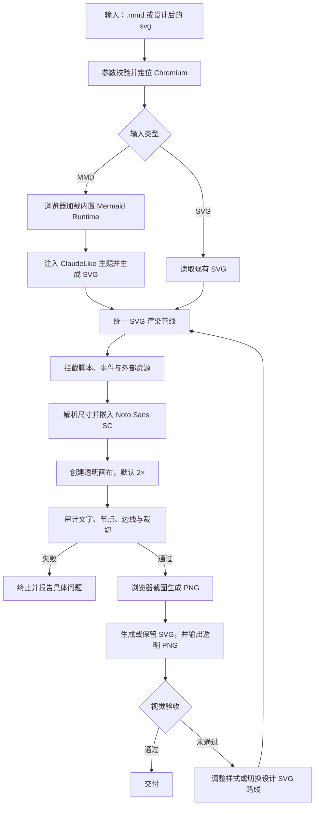

# render-mermaid

## 实现原理

核心路径是让 MMD 与设计后的 SVG 进入同一套浏览器渲染管线：SVG 保留图表语义与矢量结构，PNG 则由真实浏览器截图生成，不使用图像生成重绘。

```mermaid
flowchart TD
    A["输入：.mmd 或设计后的 .svg"] --> B["参数校验并定位 Chromium"]
    B --> C{"输入类型"}
    C -->|MMD| D["浏览器加载内置 Mermaid Runtime"]
    D --> E["注入 ClaudeLike 主题并生成 SVG"]
    C -->|SVG| F["读取现有 SVG"]
    E --> G["统一 SVG 渲染管线"]
    F --> G
    G --> H["拦截脚本、事件与外部资源"]
    H --> I["解析尺寸并嵌入 Noto Sans SC"]
    I --> J["创建透明画布，默认 2×"]
    J --> K["审计文字、节点、边线与裁切"]
    K -->|失败| L["终止并报告具体问题"]
    K -->|通过| M["浏览器截图生成 PNG"]
    M --> N["生成或保留 SVG，并输出透明 PNG"]
    N --> O{"视觉验收"}
    O -->|通过| P["交付"]
    O -->|未通过| Q["调整样式或切换设计 SVG 路线"]
    Q --> G
```

<!-- Sudark will complete the remaining README sections. -->
